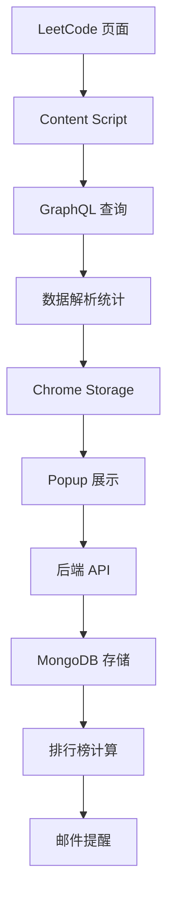

# LeetCode 朋友刷题小组

一个完整的 LeetCode 刷题小组系统，包含 Chrome 扩展和后端服务，支持实时排行榜、组队功能和邮件提醒。

## 🎯 项目概述

### 核心功能
- **实时统计**：自动采集 LeetCode 今日解题数量
- **组队刷题**：创建或加入刷题小组，邀请朋友
- **排行榜**：实时显示组内排名（今日/本周）
- **一键提醒**：通过邮件提醒朋友刷题
- **数据可视化**：解题趋势和统计图表

### 技术特色
- **双重采集策略**：优先详细数据，降级到日历数据
- **隐私保护**：不存储用户 Cookie，仅上传统计结果
- **实时同步**：5分钟自动刷新，页面聚焦时更新
- **容错设计**：GraphQL 接口变更时的降级处理

## 🏗️ 项目结构

```
CodeCrew/
├── extension/                 # Chrome 扩展
│   ├── manifest.json         # 扩展清单
│   ├── background.js         # 后台服务
│   ├── content.js           # 数据采集脚本
│   ├── popup.html           # 弹窗界面
│   ├── popup.js             # 弹窗逻辑
│   ├── icons/               # 图标文件
│   └── README.md            # 扩展文档
├── backend/                  # 后端服务
│   ├── server.js            # 服务器入口
│   ├── package.json         # 依赖配置
│   ├── models/              # 数据模型
│   │   ├── User.js          # 用户模型
│   │   ├── Group.js         # 组模型
│   │   └── DailyStats.js    # 每日统计模型
│   ├── routes/              # API 路由
│   │   ├── auth.js          # 认证相关
│   │   ├── groups.js        # 组队管理
│   │   ├── stats.js         # 统计排行
│   │   └── reminders.js     # 提醒功能
│   ├── middleware/          # 中间件
│   │   └── auth.js          # 认证中间件
│   ├── env.example          # 环境变量示例
│   └── README.md            # 后端文档
└── README.md                # 项目总览
```

## 🚀 快速开始

### 1. 后端服务

```bash
# 进入后端目录
cd backend

# 安装依赖
npm install

# 配置环境变量
cp env.example .env
# 编辑 .env 文件，填入实际配置

# 启动 MongoDB（确保服务运行）
# Windows: net start MongoDB
# macOS/Linux: sudo systemctl start mongod

# 启动服务
npm run dev
```

### 2. Chrome 扩展

```bash
# 打开 Chrome 浏览器
# 访问 chrome://extensions/
# 开启"开发者模式"
# 点击"加载已解压的扩展程序"
# 选择 extension 文件夹
```

### 3. 配置扩展

编辑 `extension/popup.js`，更新配置：

```javascript
const API_BASE_URL = 'http://localhost:3000/api';
const GOOGLE_CLIENT_ID = 'your-google-client-id.apps.googleusercontent.com';
```

## 📋 功能清单

### ✅ 已完成功能

- [x] Chrome MV3 扩展骨架
- [x] LeetCode GraphQL 数据采集
- [x] 双重采集策略（详细数据 + 日历降级）
- [x] 后端 API 服务（Node.js + Express + MongoDB）
- [x] Google OAuth 登录
- [x] 组队管理（创建/加入/离开）
- [x] 实时排行榜（今日/本周）
- [x] 邮件提醒功能（SendGrid）
- [x] 用户设置和偏好
- [x] 数据统计和上报

### 🔄 待完善功能

- [ ] Google OAuth 前端集成
- [ ] 微信登录支持
- [ ] 微信小程序绑定
- [ ] 数据可视化图表
- [ ] 推送通知
- [ ] 移动端适配
- [ ] 多语言支持

## 🔧 技术栈

### 前端（Chrome 扩展）
- **Manifest V3**：最新扩展标准
- **Content Scripts**：页面数据采集
- **Background Service Worker**：后台任务
- **Chrome Storage API**：本地数据缓存
- **Chrome Alarms API**：定时任务

### 后端服务
- **Node.js + Express**：服务器框架
- **MongoDB + Mongoose**：数据库和 ODM
- **JWT**：用户认证
- **Google OAuth 2.0**：第三方登录
- **SendGrid**：邮件服务
- **Express Rate Limit**：请求限流

### 数据采集
- **LeetCode GraphQL API**：官方数据接口
- **双重策略**：详细数据 + 日历降级
- **容错处理**：接口变更时的降级方案
- **隐私保护**：不存储用户敏感信息

## 📊 数据流程



## 🔒 隐私与安全

### 数据收集原则
- 仅收集用户明确授权的公开数据
- 不存储用户密码或敏感信息
- 统计数据仅用于排行榜展示

### 安全措施
- JWT 令牌认证
- 请求频率限制
- CORS 安全配置
- 输入验证和清理

### 合规性
- 遵循 Chrome 扩展政策
- 不干扰 LeetCode 网站功能
- 提供数据删除选项

## 🚀 部署指南

### 开发环境
1. 本地运行 MongoDB
2. 启动后端服务（端口 3000）
3. 加载 Chrome 扩展
4. 配置环境变量

### 生产环境
1. 部署后端到云服务器
2. 配置 MongoDB 集群
3. 设置 HTTPS 和域名
4. 发布 Chrome 扩展到商店

## 📈 性能优化

### 扩展优化
- 5分钟定时刷新，避免频繁请求
- 本地缓存减少 API 调用
- 页面聚焦时智能刷新

### 后端优化
- 数据库索引优化
- API 响应缓存
- 请求限流保护

## 🤝 贡献指南

1. Fork 项目
2. 创建功能分支
3. 提交更改
4. 创建 Pull Request

## 📄 许可证

MIT License

## 📞 联系方式

如有问题或建议，请通过以下方式联系：
- 创建 Issue
- 发送邮件
- 微信群讨论

---

**让刷题更有趣，让学习更高效！** 🎉